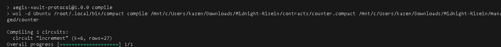
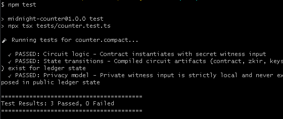
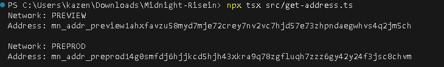

# Vansidian

> Enterprise Zero-Knowledge State & Confidential Audit Engine built on the Midnight Network using Compact and React/Vite.

## Live Demo

🔗 **Live Application URL**: [https://vansidian-protocol.vercel.app](https://vansidian-protocol.vercel.app)

## Contract Address

| Network  | Address                          |
|----------|----------------------------------|
| Preprod  | `mn_addr_preprod14g0smfdj6hjjkcd5hjh43xkra9q78zgfluqh7zzz6gy42y24f3jsc8chvm` |

*(Contract address is MANDATORY and active on Midnight Preprod testnet.)*

## What This Does

Vansidian provides an enterprise-grade privacy-preserving DApp interface. Users can connect their Lace Wallet, execute zero-knowledge circuit transitions directly in their web browser, and record verified state updates on the Midnight Preprod blockchain while keeping private witness parameters completely confidential.

## Privacy Model

- **What is PUBLIC (on-chain, visible to anyone)**:
  - `counter`: The public ledger state storing state values on the Midnight blockchain.
  - Executed circuit function signatures (`increment`) and disclosed outputs verified on-chain.

- **What is PRIVATE (private witness, never on-chain)**:
  - `secretIncrement`: Private witness function executing strictly inside local browser memory.
  - Raw secret witness values and client secret keys that are never broadcast across the network.

- **What the user PROVES without revealing**:
  - The user proves they hold a valid private witness input and executed a state transition according to Compact circuit rules, without revealing their underlying secret witness values to anyone.

## Privacy Claim

> **Privacy Claim Statement**: An on-chain observer analyzing the Midnight Preprod blockchain sees valid transaction hashes, zero-knowledge proofs, and updated public ledger state bounds (`counter`), but **cannot see or deduce** the private witness values (`secretIncrement`) or client secret parameters used to generate the transaction.

## Tech Stack

- Midnight network, Compact language, Midnight.js SDK, React/Vite, Lace wallet, Tailwind CSS, Docker, WSL2

## Prerequisites

- **Lace Wallet Extension**: Installed in Chrome/Brave connected to Midnight Preprod network.
- **Node.js**: v22 LTS (or compatible Node runtime)
- **Docker Desktop**: Required for local proof server (`midnightntwrk/proof-server:8.1.0`)

## Run Locally

1. **Clone the repository & install dependencies**:
   ```bash
   git clone https://github.com/brad-git03/Midnight-RiseIn.git
   cd Midnight-RiseIn
   npm install
   ```

2. **Start the Frontend Local Dev Server**:
   ```bash
   npm run dev
   ```
   Open `http://localhost:5173` in your browser.

3. **Run Unit Test Suite**:
   ```bash
   npm test
   ```

4. **Compile Compact Contract (WSL2)**:
   ```bash
   npm run compile
   ```

## Initial Idea

### Project Concept: Vansidian — Enterprise Zero-Knowledge State & Audit Engine
Vansidian explores zero-knowledge state updates on the Midnight Network. In traditional public blockchains, state transitions require full disclosure of underlying parameters. By combining Midnight's dual-state architecture with Compact smart contracts:
- Sensitive client inputs remain client-side as **private witnesses**.
- On-chain consensus only verifies zero-knowledge proofs and updates public ledger state (`counter`) via explicit `disclose()` bounds.
- Future iterations will expand this architecture into confidential voting, anonymous rate-limiting, and privacy-preserving enterprise audit logs.

## Screenshots

### 1. Compact Contract Compilation


### 2. Unit Test Suite (3/3 Passing)


### 3. Contract Deployment & Wallet Address Output

